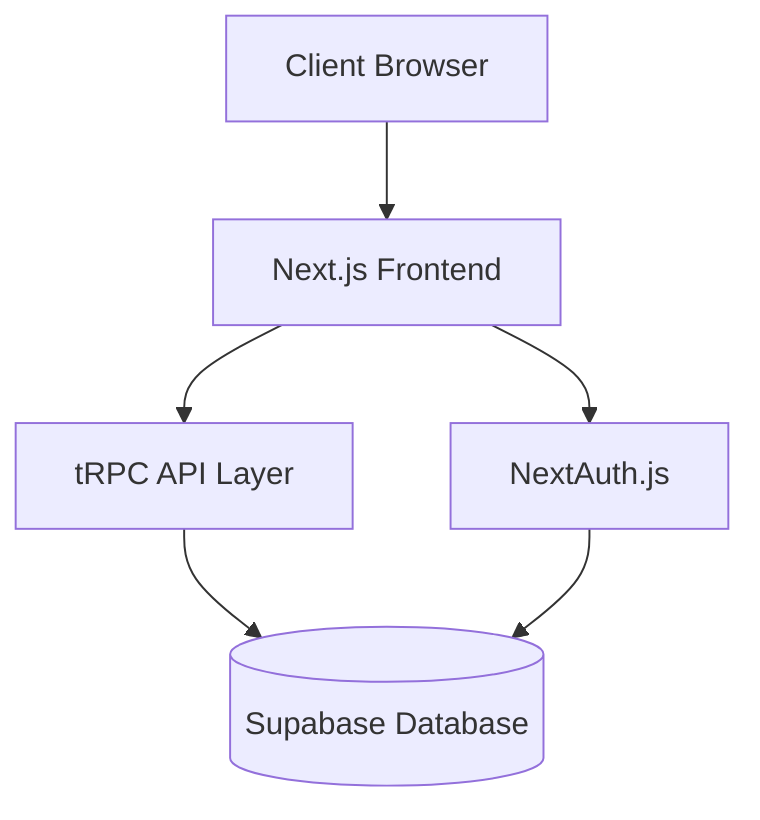
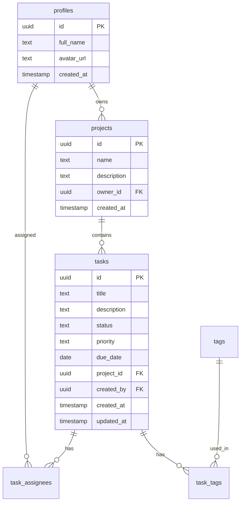

# Project Management Application

A modern, full-stack project management solution built with Next.js, tRPC, and Supabase.

## Why This Project?

Managing projects and tasks effectively requires a robust, user-friendly platform that enables teams to:
- Track project progress and task status
- Collaborate efficiently
- Visualize project metrics
- Manage team members and assignments
- Organize tasks with tags and priorities

## What It Does

### Core Features
- 📊 **Dashboard Analytics**: Real-time visualization of project metrics and task distribution
- 🗂️ **Project Management**: Create, update, and organize projects
- ✅ **Task Tracking**: Comprehensive task management with status, priority, and due dates
- 👥 **Team Collaboration**: Assign tasks to team members and manage project participants
- 🏷️ **Tag System**: Organize tasks with customizable tags
- 🔐 **Authentication**: Secure user authentication via NextAuth.js

## How It Works

### Architecture



### Database Schema



## Technology Stack

- **Frontend**: 
  - Next.js 15
  - React 19
  - TailwindCSS
  - Recharts for data visualization
  - React Query for state management

- **Backend**:
  - tRPC for type-safe API
  - Supabase for database and authentication
  - Zod for schema validation

- **DevOps**:
  - TypeScript for type safety
  - ESLint & Prettier for code quality
  - SST for infrastructure

## Project Structure

```
src/
├── app/                    # Next.js App Router
├── components/            # React components
│   ├── Dashboard.tsx
│   ├── TaskForm.tsx
│   └── ...
├── pages/                # Next.js Pages
│   ├── api/             # API routes
│   ├── projects/        # Project pages
│   └── tasks/          # Task management pages
├── server/              # Backend logic
│   ├── api/            # tRPC API definitions
│   └── auth/           # Authentication setup
└── utils/              # Utility functions
```

## Setup and Installation

1. Clone the repository
2. Install dependencies:
   ```bash
   npm install
   ```

3. Set up environment variables:
   ```bash
   cp .env.example .env
   ```
   Fill in your Supabase and other configuration details.

4. Run the development server:
   ```bash
   npm run dev
   ```

5. For production:
   ```bash
   npm run build
   npm run start
   ```

## Development Commands

- `npm run dev` - Start development server
- `npm run build` - Build for production
- `npm run check` - Run type checking and linting
- `npm run format:write` - Format code with Prettier
- `npm run seed-db` - Seed the database with initial data

## Security

- Authentication handled by NextAuth.js
- Database access through Supabase with RLS policies
- Type-safe API calls with tRPC
- Environment variable validation with Zod

## Best Practices

- TypeScript for type safety across the full stack
- React Query for efficient data fetching and caching
- Component-based architecture for reusability
- Responsive design with TailwindCSS
- Automated code formatting and linting

## Future Enhancements

1. Real-time collaboration features
2. Advanced reporting and analytics
3. Integration with third-party tools
4. Mobile application
5. Enhanced notification system

## Contributing

1. Fork the repository
2. Create a feature branch
3. Commit your changes
4. Push to the branch
5. Create a Pull Request

## License

This project is licensed under the MIT License - see the LICENSE file for details.
