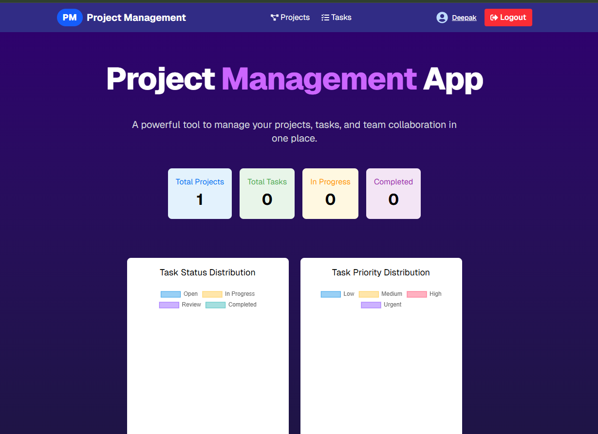
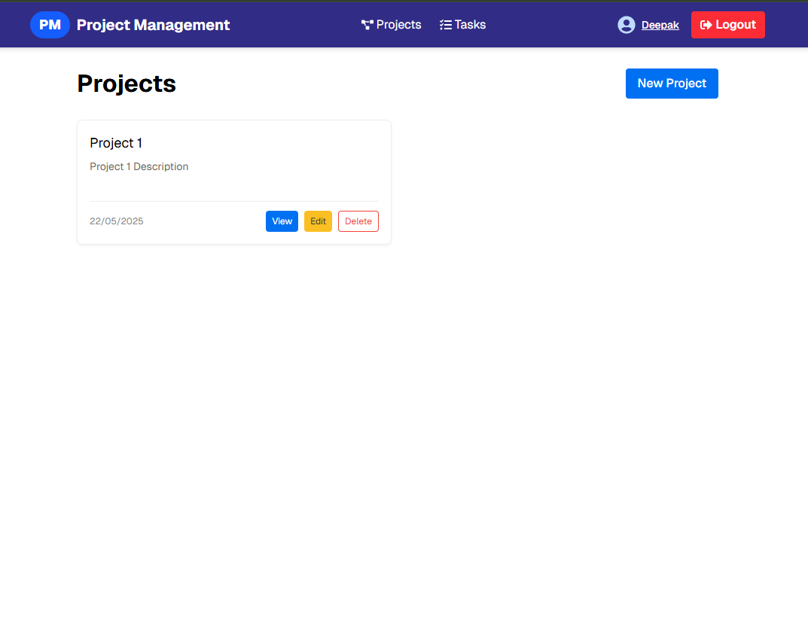
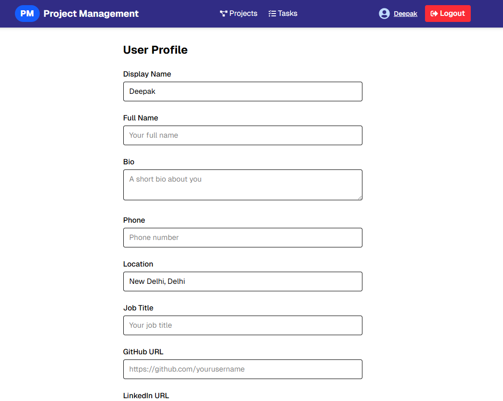
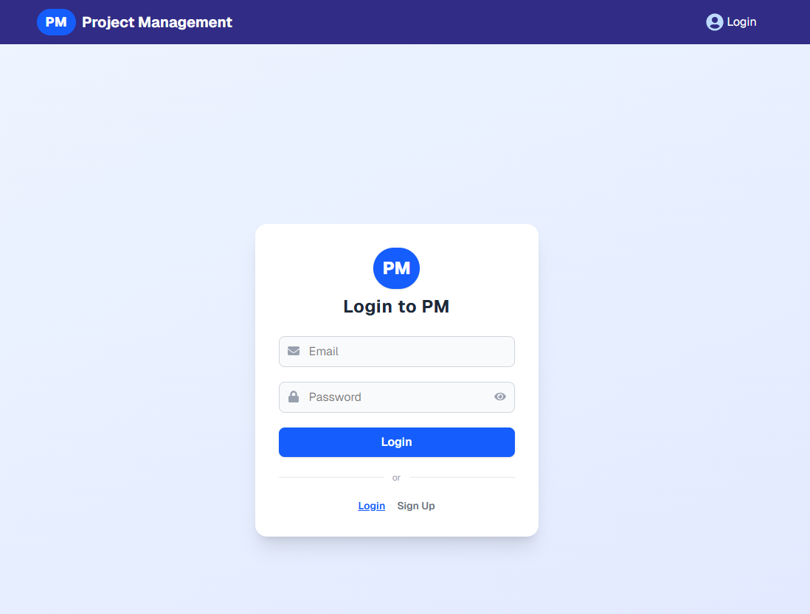
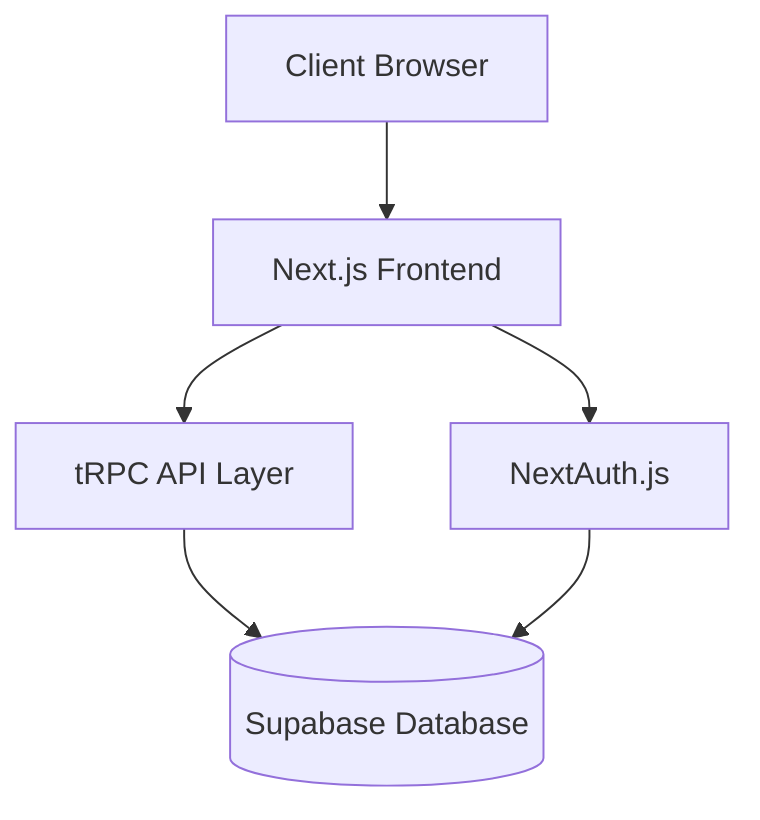
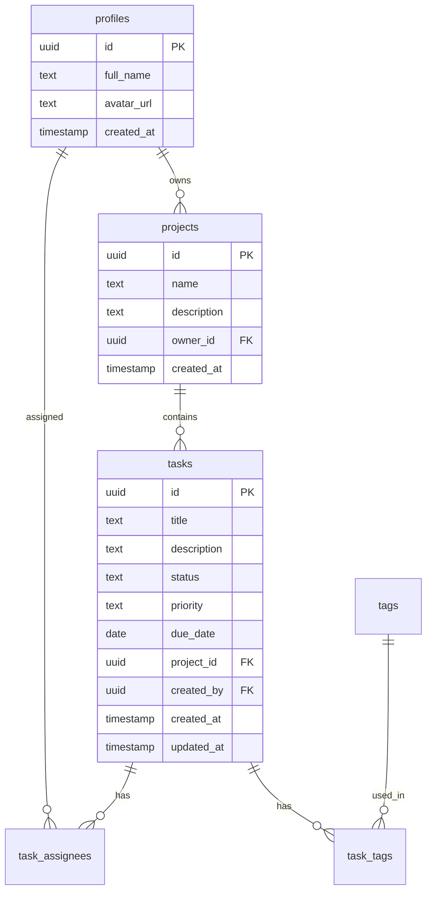
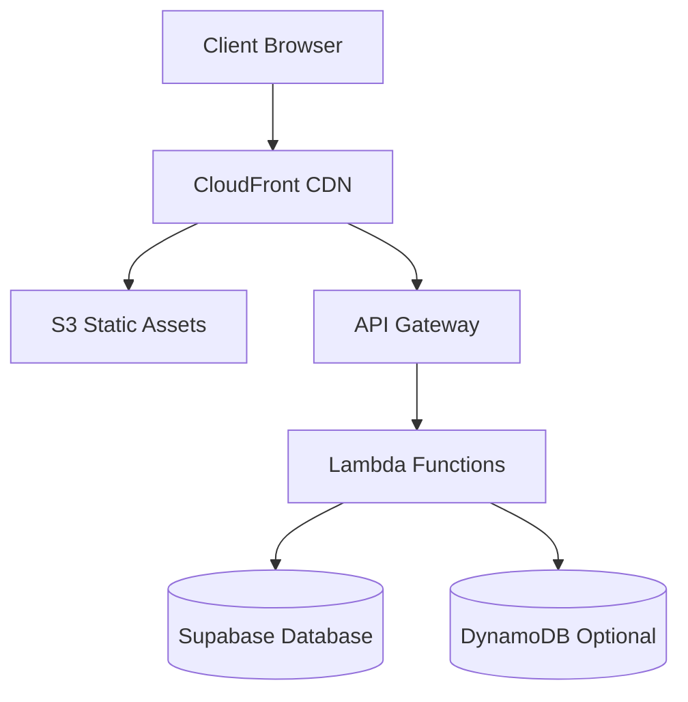

# Project Management Application

A modern, full-stack project management solution built with Next.js, tRPC, and Supabase.

🌐 **Live Demo**: [https://d3grg4oigb87jb.cloudfront.net/](https://d3grg4oigb87jb.cloudfront.net/)

## Demo Screenshots

### Dashboard

*Real-time project analytics and task distribution visualization*

### Project Management

*Organize and track multiple projects with detailed views*

### User Profile

*Personalized user settings and activity tracking*

### Authentication

*Secure authentication with multiple login options*

## Why This Project?

Managing projects and tasks effectively requires a robust, user-friendly platform that enables teams to:
- Track project progress and task status
- Collaborate efficiently
- Visualize project metrics
- Manage team members and assignments
- Organize tasks with tags and priorities

## What It Does

### Core Features
- 📊 **Dashboard Analytics**: Real-time visualization of project metrics and task distribution
- 🗂️ **Project Management**: Create, update, and organize projects
- ✅ **Task Tracking**: Comprehensive task management with status, priority, and due dates
- 👥 **Team Collaboration**: Assign tasks to team members and manage project participants
- 🏷️ **Tag System**: Organize tasks with customizable tags
- 🔐 **Authentication**: Secure user authentication via NextAuth.js

## How It Works

### Architecture



### Database Schema



## Technology Stack

### T3 Stack Overview
This project is built on the T3 Stack, a full-stack, typesafe web development framework that includes:
- **TypeScript**: End-to-end type safety
- **tRPC**: Enables type-safe API calls between client and server
- **Tailwind CSS**: Utility-first CSS framework
- **Next.js**: React framework for production
- **Prisma**: Type-safe ORM (configured for Supabase)
- **NextAuth.js**: Flexible authentication

### Frontend 
- **Next.js 15**: Server-side rendering, API routes, and optimized build
- **React 19**: UI component library with latest features
- **TailwindCSS**: Responsive design with utility classes
- **Recharts**: Interactive data visualization
- **React Query**: Powerful data synchronization with server

### Backend
- **tRPC**: Type-safe API layer with:
  - Automatic type inference
  - Real-time subscriptions
  - Integrated caching
- **Supabase**: 
  - PostgreSQL database
  - Row Level Security
  - Real-time capabilities
  - Built-in authentication
- **Zod**: Runtime type validation

### AWS Infrastructure (via SST)
SST (Serverless Stack) provides Infrastructure as Code for AWS:
- **API Gateway**: Handles API requests
- **Lambda**: Serverless compute for API endpoints
- **CloudFront**: CDN for static assets
- **S3**: Storage for uploads and assets
- **DynamoDB**: NoSQL database (optional)
- **Auto-scaling**: Managed by AWS
- **Monitoring**: CloudWatch integration

### Development & DevOps
- **SST Features**:
  - Live Lambda development
  - Automatic IAM permissions
  - Cost-effective development stages
  - Environment management
  - Asset deployment
- **Code Quality**:
  - ESLint for linting
  - Prettier for formatting
  - TypeScript for type checking
  - Husky for git hooks

## Project Structure

```
src/
├── app/                    # Next.js App Router
├── components/            # React components
│   ├── Dashboard.tsx
│   ├── TaskForm.tsx
│   └── ...
├── pages/                # Next.js Pages
│   ├── api/             # API routes
│   ├── projects/        # Project pages
│   └── tasks/          # Task management pages
├── server/              # Backend logic
│   ├── api/            # tRPC API definitions
│   └── auth/           # Authentication setup
└── utils/              # Utility functions
```

## Setup and Installation

1. Clone the repository
2. Install dependencies:
   ```bash
   npm install
   ```

3. Set up environment variables:
   ```bash
   cp .env.example .env
   ```
   Fill in your Supabase and other configuration details.

4. Run the development server:
   ```bash
   npm run dev
   ```

5. For production:
   ```bash
   npm run build
   npm run start
   ```

## Development Commands

- `npm run dev` - Start development server
- `npm run build` - Build for production
- `npm run check` - Run type checking and linting
- `npm run format:write` - Format code with Prettier
- `npm run seed-db` - Seed the database with initial data

## Testing

The project uses Jest and React Testing Library for comprehensive testing. For detailed test documentation, configuration, and guidelines, see [Test Documentation](TEST.md).

### Test Commands
- `npm test` - Run all tests
- `npm test -- --coverage` - Run tests with coverage report
- `npm test -- --watch` - Run tests in watch mode

### Test Configuration
- Jest for test running and assertions
- React Testing Library for component testing
- Coverage thresholds set at 80% for:
  - Branches
  - Functions
  - Lines
  - Statements

## Security

- Authentication handled by NextAuth.js
- Database access through Supabase with RLS policies
- Type-safe API calls with tRPC
- Environment variable validation with Zod

## Deployment & Infrastructure

### AWS Architecture


### SST Deployment
SST (Serverless Stack) manages AWS infrastructure:

```bash
# Deploy to development
npm run sst deploy --stage dev

# Deploy to production
npm run sst deploy --stage prod
```

Key SST Features:
1. **Infrastructure as Code**: 
   - Define AWS resources using TypeScript
   - Automatic CloudFormation template generation
   - Resource permissions management

2. **Development Environment**:
   - Local Lambda development
   - Hot reloading for functions
   - Stage management for different environments

3. **AWS Resources Management**:
   - Automatic cleanup of resources
   - Cost optimization
   - Built-in monitoring and debugging

4. **CI/CD Integration**:
   - GitHub Actions workflows
   - Automated deployments
   - Environment segregation

## Best Practices

### T3 Stack Best Practices
- Use tRPC for type-safe API communication
- Leverage Zod for runtime type validation
- Implement proper error boundaries
- Follow Next.js performance guidelines

### AWS & SST Best Practices
- Configure proper IAM roles and permissions
- Implement resource tagging
- Set up monitoring and alerts
- Use environment variables for configuration
- Implement proper error handling in Lambda functions

### Development Best Practices
- TypeScript for type safety across the full stack
- React Query for efficient data fetching and caching
- Component-based architecture for reusability
- Responsive design with TailwindCSS
- Automated code formatting and linting

## Future Enhancements

1. Real-time collaboration features
2. Advanced reporting and analytics
3. Integration with third-party tools
4. Mobile application
5. Enhanced notification system

## Contributing

1. Fork the repository
2. Create a feature branch
3. Commit your changes
4. Push to the branch
5. Create a Pull Request

## License

This project is licensed under the MIT License - see the LICENSE file for details.
